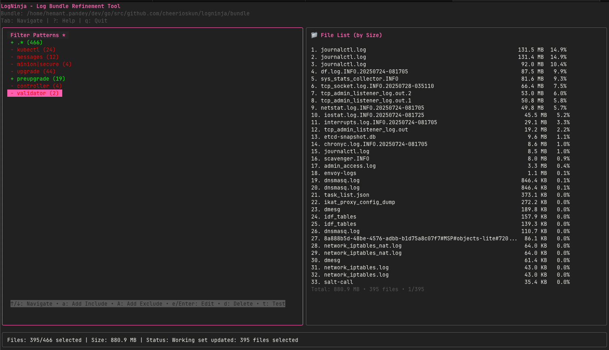

# LogNinja

Interactive terminal tool for filtering and refining massive log bundles. Instead of copying entire log directories or writing complex scripts, visually explore and select exactly what you need before export. Logninja has real-time regex filtering with live size estimates. Export only what matters.

---

## Installing

```bash
go install github.com/cheerioskun/logninja@latest
```

---

## Usage

```bash
# 1. Start interactive mode
logninja tui /path/to/massive/log/bundle
```



```
LogNinja is a Terminal User Interface (TUI) application for refining log bundles.
It allows you to:
- Select which files to include in your bundle
- Filter by time range
- Apply regex patterns for include/exclude filtering
- Visualize log volume with histograms
- Export refined bundles

Use 'logninja tui <path>' to start the interactive interface, press E to export.ß

Usage:
  logninja [command]

Available Commands:
  completion  Generate the autocompletion script for the specified shell
  help        Help about any command
  init        Initialize a working set configuration for a log directory
  scan        Scan a directory for log files using content analysis
  tui         Start the interactive TUI interface

Flags:
      --config string   config file (default is $HOME/.logninja.yaml)
  -h, --help            help for logninja
  -v, --verbose         verbose output
      --version         version for logninja

Use "logninja [command] --help" for more information about a command.
```


---

## Roadmap
- Time slicing and real-time log volume histogram
- Log file detection based on content
- Filetree view to select files/folders without regex
