# LogNinja Codebase Audit & Status Report

*Generated: 2025-08-21T14:00:00 IST*

## Overview

LogNinja is a well-architected Terminal User Interface (TUI) application for refining log bundles. This comprehensive audit examines data models, data flows, user workflows, and identifies optimization opportunities to enhance maintainability and performance.

## 📊 Data Models Analysis

### Core Architecture

```mermaid
graph TB
    subgraph "Core Data Models"
        Bundle["Bundle<br/>• Path, Files, TotalSize<br/>• TimeRange, Metadata<br/>• ScanTime, fs (afero.Fs)"]
        FileInfo["FileInfo<br/>• Path, Size, IsLogFile<br/>• TimeRange, Selected<br/>• LastModified"]
        BundleMetadata["BundleMetadata<br/>• LogFileCount, TotalFileCount<br/>• OldestLog, NewestLog<br/>• CommonFormats, ScanDepth"]
        
        Bundle --> FileInfo
        Bundle --> BundleMetadata
    end
    
    subgraph "Working State Models"
        WorkingSet["WorkingSet<br/>• Bundle, SelectedFiles<br/>• IncludeRegex, ExcludeRegex<br/>• TimeFilter, EstimatedSize<br/>• VolumeData, LastUpdated"]
        VolumePoint["VolumePoint<br/>• BinStart, BinEnd<br/>• Count, Size, FileCount"]
        
        WorkingSet --> Bundle
        WorkingSet --> VolumePoint
    end
    
    subgraph "Final Output Models"
        FileSet["FileSet<br/>• Files, TotalSize<br/>• TimeRange, Criteria<br/>• LineCount"]
        FilterCriteria["FilterCriteria<br/>• IncludeRegex, ExcludeRegex<br/>• TimeRange, FilePattern<br/>• OnlyLogFiles"]
        
        FileSet --> FilterCriteria
    end
    
    subgraph "Shared Components"
        TimeRange["TimeRange<br/>• Start, End<br/>+ Duration(), Contains()<br/>+ Overlaps(), Intersection()"]
    end
    
    Bundle -.-> TimeRange
    WorkingSet -.-> TimeRange
    FileSet -.-> TimeRange
    FilterCriteria -.-> TimeRange
    
    subgraph "UI-Specific Models"
        AppModel["AppModel<br/>• workingSet<br/>• includePanel, excludePanel<br/>• fileListPanel, histogramPanel<br/>• focused, width, height"]
        RegexModel["Regex Models<br/>• Pattern (Text, Compiled, Valid)<br/>• SingleModel vs Model<br/>• Similar structure, different use"]
        
        AppModel --> WorkingSet
        AppModel --> RegexModel
    end
```

### Identified Data Structures

| Category | Struct | Location | Purpose |
|----------|--------|----------|---------|
| **Core Models** | `Bundle` | `internal/models/bundle.go` | Root container for log bundle |
| | `FileInfo` | `internal/models/bundle.go` | Individual file metadata |
| | `BundleMetadata` | `internal/models/bundle.go` | Aggregate bundle information |
| | `WorkingSet` | `internal/models/workingset.go` | Current user selections/filters |
| | `VolumePoint` | `internal/models/workingset.go` | Time-binned histogram data |
| | `FileSet` | `internal/models/fileset.go` | Final filtered result |
| | `FilterCriteria` | `internal/models/fileset.go` | Applied filter settings |
| | `TimeRange` | `internal/models/timerange.go` | Time span operations |
| **Processing** | `BundleScanner` | `internal/scanner/bundle.go` | File discovery and scanning |
| | `TimestampExtractor` | `internal/parser/timestamp.go` | Timestamp pattern detection |
| | `TimestampPattern` | `internal/parser/timestamp.go` | Regex pattern definition |
| | `BoundsExtractor` | `internal/parser/bounds.go` | Time boundary extraction |
| | `HistogramBuilder` | `internal/parser/histogram.go` | Volume histogram generation |
| | `VolumeAnalyzer` | `internal/parser/volume.go` | Volume distribution analysis |
| **UI Components** | `AppModel` | `ui/app.go` | Main application state |
| | `Model` (regex) | `ui/regex/model.go` | Dual-section regex panel |
| | `SingleModel` | `ui/regex/single.go` | Single regex panel |
| | `Model` (histogram) | `ui/histogram/model.go` | Volume visualization |
| | `Model` (filelist) | `ui/filelist/model.go` | File selection interface |
| **Messages** | `RegexFiltersChangedMsg` | `internal/messages/messages.go` | Regex filter update notification |
| | `WorkingSetUpdatedMsg` | `internal/messages/messages.go` | Selection change notification |
| | Various UI Messages | `ui/*/model.go` | Component-specific events |

## 🔄 Data Flow Analysis

### Application Data Pipeline

```mermaid
graph TD
    Input["User Input: Bundle Path"] --> Scanner["BundleScanner<br/>Phase 1: WalkDir + collect all files<br/>Phase 2: Content peek + log detection"]
    
    Scanner --> Bundle["Bundle Creation<br/>• File metadata collection<br/>• Timestamp extraction<br/>• TimeRange calculation"]
    
    Bundle --> WorkingSet["WorkingSet Creation<br/>• Initial file selection<br/>• Empty regex patterns<br/>• No time filter"]
    
    WorkingSet --> UI["UI Initialization<br/>• AppModel creation<br/>• Component setup<br/>• Message routing"]
    
    subgraph "User Interaction Loop"
        UserAction["User Action<br/>• File selection<br/>• Regex patterns<br/>• Time range changes"] 
        
        UserAction --> MessageFlow["Message Flow<br/>RegexFiltersChangedMsg<br/>WorkingSetUpdatedMsg<br/>Component-specific messages"]
        
        MessageFlow --> DataUpdate["Data Updates<br/>• WorkingSet modification<br/>• Filter application<br/>• Volume recalculation"]
        
        DataUpdate --> UIRefresh["UI Refresh<br/>• Histogram update<br/>• File list update<br/>• Status display"]
        
        UIRefresh --> UserAction
    end
    
    subgraph "Processing Pipeline"
        Parsing["Parsing Layer<br/>• TimestampExtractor<br/>• BoundsExtractor<br/>• HistogramBuilder<br/>• VolumeAnalyzer"]
        
        Scanner --> Parsing
        DataUpdate --> Parsing
        
        Parsing --> Storage["Data Storage<br/>• In-memory structures<br/>• Efficient access patterns<br/>• Stream processing"]
    end
    
    WorkingSet --> Export["Export Flow<br/>FileSet creation<br/>Filter application<br/>Bundle generation"]
```

### Data Transformation Flow

1. **Initialization**: `Bundle Path` → `BundleScanner` → `Bundle` → `WorkingSet` → `AppModel`
2. **User Interactions**: `UI Events` → `Messages` → `WorkingSet Updates` → `Component Refreshes`
3. **Processing**: `File Operations` → `Parser Layer` → `In-Memory Storage` → `UI Display`
4. **Output**: `WorkingSet` → `FileSet` → `Export` (planned)

## 👤 User Flow Analysis

### Primary User Workflows

### Validated User Assumptions

- ✅ **Large Bundle Handling**: Architecture supports 10GB+ bundles efficiently
- ✅ **Visual Refinement**: TUI approach aligns with interactive exploration needs
- ✅ **Time-based Filtering**: Well-supported with histogram visualization
- ⚠️ **Regex Expertise**: Limited progressive disclosure for varying skill levels

## 🔍 Key Findings & Redundancies

### Critical Issues

#### 🔴 **High Priority: Regex Pattern Duplication**
- **Location**: `ui/regex/model.go` vs `ui/regex/single.go`
- **Issue**: Nearly identical Pattern structs and processing logic (~90% code duplication)
- **Impact**: 
  - ~500 lines of redundant code
  - Maintenance burden for updates
  - Potential for inconsistent behavior
  - Harder to extend functionality

#### 🟡 **Medium Priority: Message System Redundancy**
- **Issue**: `WorkingSetUpdatedMsg` exists in multiple locations with different field sets
- **Locations**: 
  - `internal/messages/messages.go` (comprehensive)
  - `ui/histogram/model.go` (component-specific)
- **Impact**: Confusion about canonical message format, duplicate handling logic

#### 🟠 **Lower Priority: Size Calculation Redundancy**
- **Issue**: Size calculations performed at multiple stages:
  - `Bundle.TotalSize` (during scanning)
  - `WorkingSet.EstimatedSize` (with selections)  
  - `FileSet.TotalSize` (after filtering)
- **Impact**: Triple computation of similar data, potential inconsistencies

### Data Flow Inefficiencies

1. **Linear Processing Chain**: Sequential transformations create multiple data copies
2. **Message Broadcasting**: Components receive irrelevant updates causing unnecessary processing
3. **Real-time Recalculation**: Expensive operations (histogram, regex matching) repeated on every change

### User Experience Gaps

1. **Missing Export Workflow**: Referenced in architecture but not implemented in UI
2. **Learning Curve**: No progressive disclosure for regex complexity
3. **Navigation**: Tab-based panel switching may not be intuitive

## 🚀 Optimization Roadmap

### Phase 1: Code Consolidation *(Immediate - Low Risk)*
**Goal**: Eliminate clear redundancies without functionality changes

#### 1.1 Unify Regex Components
- **Action**: Merge `ui/regex/model.go` and `ui/regex/single.go`
- **Approach**: Create configurable `RegexPanel` with include/exclude modes
- **Benefit**: ~50% code reduction, consistent behavior
- **Effort**: 2-3 days
- **Risk**: Low (pure refactoring)

#### 1.2 Standardize Message System
- **Action**: Consolidate `WorkingSetUpdatedMsg` into single canonical version
- **Approach**: Use `internal/messages/` as source of truth
- **Benefit**: Clear contracts, reduced coupling
- **Effort**: 1 day
- **Risk**: Low (interface change only)

#### 1.3 Extract Common UI Patterns
- **Action**: Create base `PanelComponent` interface
- **Approach**: Standardize Focus/Blur/SetSize/Update patterns
- **Benefit**: Consistent behavior, reduced boilerplate
- **Effort**: 1-2 days
- **Risk**: Low (interface extraction)

### Phase 2: Data Flow Optimization *(Medium - Moderate Risk)*
**Goal**: Improve performance and reduce computational redundancy

#### 2.1 Implement Reactive Data Pipeline
- **Action**: Replace sequential transformations with reactive updates
- **Approach**: Event sourcing for filter changes, incremental computation
- **Benefit**: Faster updates, better memory usage
- **Effort**: 1-2 weeks
- **Risk**: Moderate (architectural change)

#### 2.2 Add Intelligent Caching
- **Action**: Cache expensive operations (timestamp extraction, regex compilation)
- **Approach**: LRU cache with configurable size limits
- **Benefit**: 2-3x performance improvement for large bundles
- **Effort**: 3-5 days
- **Risk**: Low (additive feature)

#### 2.3 Optimize Message Flow
- **Action**: Selective message subscription, batching
- **Approach**: Components register for specific message types only
- **Benefit**: Reduced unnecessary processing, smoother UI
- **Effort**: 3-4 days
- **Risk**: Moderate (changes message handling)

### Phase 3: User Experience Enhancement *(Long-term - Higher Risk)*
**Goal**: Improve usability based on workflow analysis

#### 3.1 Progressive Disclosure
- **Action**: Add regex pattern library, guided workflows
- **Approach**: Common log patterns, validation helpers, error guidance
- **Benefit**: Lower learning curve, reduced user errors
- **Effort**: 1-2 weeks
- **Risk**: Moderate (UX changes)

#### 3.2 Complete Export Workflow
- **Action**: Implement missing export functionality
- **Approach**: Export preview, multiple formats (copy/symlink/tar)
- **Benefit**: Complete user workflow, production readiness
- **Effort**: 1 week
- **Risk**: Low (missing feature implementation)

#### 3.3 Advanced Time Range Selection
- **Action**: Interactive histogram with clickable selection
- **Approach**: Time range presets, zoom/pan capabilities
- **Benefit**: Better time-based filtering UX
- **Effort**: 1-2 weeks
- **Risk**: Moderate (UI complexity)

### Phase 4: Architecture Modernization *(Future - High Risk)*
**Goal**: Long-term maintainability and extensibility

#### 4.1 Plugin Architecture
- **Action**: Modular log format detection, extensible filters
- **Approach**: Interface-based plugins, configuration system
- **Benefit**: Better extensibility, easier testing
- **Effort**: 3-4 weeks
- **Risk**: High (major architectural change)

#### 4.2 State Management Refactor
- **Action**: Proper state machine, undo/redo, persistence
- **Approach**: Formal state management library or pattern
- **Benefit**: More robust state handling, better UX
- **Effort**: 2-3 weeks
- **Risk**: High (fundamental change)

## 📋 Immediate Action Items

### Priority 1: Quick Wins
1. **Merge Regex Components** - Biggest code redundancy with lowest risk
2. **Standardize Messages** - Simple interface cleanup
3. **Add Timestamp Caching** - Immediate performance gain

### Priority 2: Architecture Improvements
1. **Implement Export Workflow** - Complete user journey
2. **Add Selective Message Subscription** - Performance optimization
3. **Create Component Interface** - Better code organization

### Priority 3: User Experience
1. **Regex Pattern Library** - Lower barrier to entry
2. **Interactive Histogram** - Better time selection UX
3. **Progressive Disclosure** - Guided workflows

## 🎯 Success Metrics

### Code Quality
- **Lines of Code**: Target 20% reduction through consolidation
- **Cyclomatic Complexity**: Maintain or improve current levels
- **Test Coverage**: Maintain 80%+ coverage through refactoring

### Performance
- **Bundle Scan Time**: Maintain current performance
- **UI Responsiveness**: Target <100ms for filter updates
- **Memory Usage**: Target 20% reduction through caching optimizations

### User Experience
- **Time to First Meaningful Display**: Target <2 seconds for typical bundles
- **Learning Curve**: Measure through user feedback (qualitative)
- **Workflow Completion**: 100% of core workflows implementable

## 🔄 Next Steps

1. **Validate Priorities**: Confirm Phase 1 priorities align with project goals
2. **Begin Regex Consolidation**: Start with highest-impact, lowest-risk improvement
3. **Plan Testing Strategy**: Ensure refactoring maintains existing functionality
4. **Consider User Feedback**: Gather input on UX improvements if possible

---

*This audit represents the current state as of the analysis date. Regular reviews should be conducted as the codebase evolves to maintain optimization opportunities and architectural health.*
